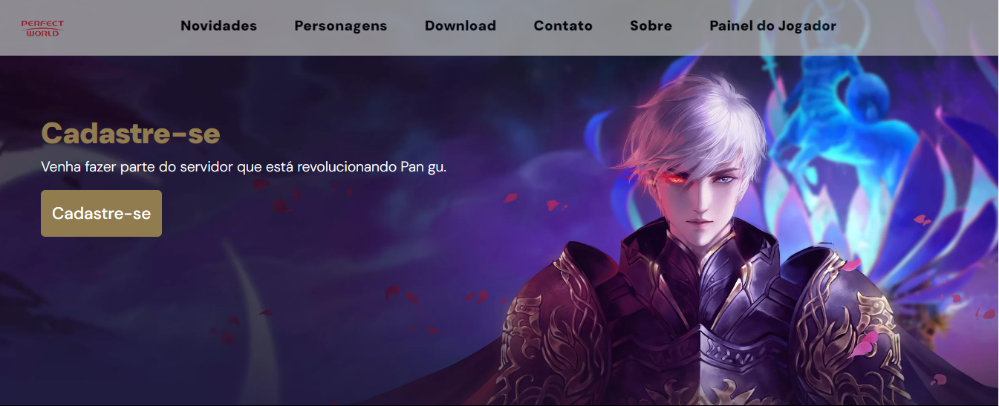

# Projeto Final de Codificação para Front-End

**Perfect World**

    

Este é o repositório para o projeto "Perfect World", desenvolvido como parte do módulo de codificação front end do projeto de desenvolvedor Full Stack aplicado pelo SENAI em parceria com o Edu Livre e Energisa.

# Descrição do Projeto

O projeto "Perfect World" é uma página web desenvolvida utilizando tecnologias front end como HTML, CSS e JavaScript. Ele foi criado como parte do aprendizado e prática durante o curso.

# Tecnologias Utilizadas

- HTML
- CSS
- JavaScript
- Bootstrap
- MySQL
- Criação de API
- Font Awesome

# Como Contribuir
Faça um fork deste repositório
Crie uma branch para sua feature (`git checkout -b feature/nova-feature`)
Faça commit de suas alterações (`git commit -am 'Adicionando uma nova feature`)
Faça push para a branch (`git push origin feature/nova-feature`)
Crie um novo Pull Request

# Vídeo de Apresentação
Vídeo no projeto e se preferir: [Projeto - Link do Youtube](https://youtu.be/oi_CPjHT1gI)

# Autores

- Luciano Costa da Silva Filho
- Luciano Duarte
- Emilly Ramos

https://www.linkedin.com/in/luciano-filho1

# Rio Pomba Valley - SENAI 

    
    
    

